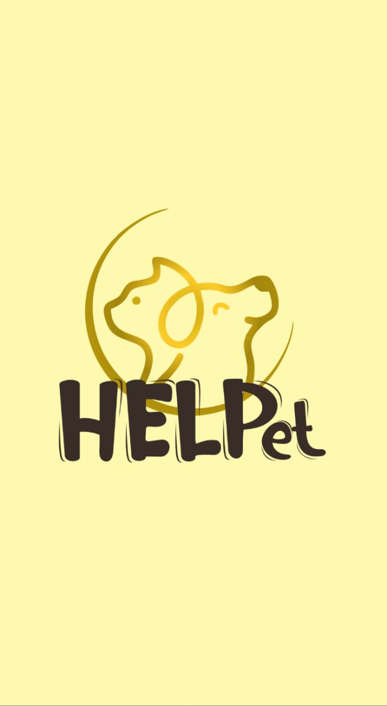

# HELPet
Projeto desenvolvido como trabalho de conclusão de curso.

<!--be-the-hero-->

<h1 align="center">  </h1>

<h2 align="center"> Aplicação desenvolvida e apresentada como projeto de conclusão do curso de Engenharia de Computação</h2>  

O projeto HELPet foi desenvolvido com o intuito de auxiliar na luta em prol da adoção de animais em situação de rua. Esse projeto
foi inspirado na Semana OminiStack 11.0 da Rocketseat.

<h2 align="center"> Desenvolvida com as tecnologias  JavaScript, 
 Node, 
 React, 
 React Native
e  SQLite.</h2>

<h3> Outras tecnologias: </h3>
<ul>
  <li> <a href="https://www.npmjs.com/package/nodemon/"> Nodemon </a> </li> 
  <li> <a href="https://expressjs.com/pt-br/"> Express </a> </li>
  <li> <a href="https://www.npmjs.com/package/axios"> Axios </a> </li>
  <li> <a href="https://www.npmjs.com/package/cors"> Cors </a> </li>
  <li> <a href="http://knexjs.org/"> Knex </a> </li>
  <li> <a href="https://expo.io/"> Expo </a> </li>  
</ul>

<h3> Para utilizar: </h3>

 Faça o download do projeto no GitHub  
 Execute <code>npm install</code> nas pastas <b>backend, frontend e mobile</b>, para instalar as dependências. 
 Execute <code>npm start</code> na pasta <b>back-end</b> para rodar o servidor na porta localhost:3333 
 Execute <code>npm start</code> na pasta <b>front-end</b> para rodar a página web na porta localhost:3000 
 Execute <code>npm start</code> na pasta <b>mobile</b>, acesse localhost:19002, leia o QR Code no seu 
celular utilizando o aplicativo Expo <a href="https://play.google.com/store/apps/details?id=host.exp.exponent&hl=pt_BR"> (Download na Playstore) </a> -
<a href="https://apps.apple.com/br/app/expo-client/id982107779"> (Download na App Store) </a>. É possível também usar algum emulador de Android ou iOS. 

<h3> Interface WEB: </h3>
<table>
	<tr>
		<th width="100%">
			Tela de Login 
		</th>
	</tr>
	<tr>
		<td>
			
		</td>
	</tr>
		<tr>
		<th width="100%">
			Tela de Cadastro 
		</th>
	</tr>
	<tr>
		<td>
			
		</td>
	</tr>
		<tr>
		<th width="100%">
			Todos os Casos Cadastrados  
		</th>
	</tr>
	<tr>
		<td>
			
		</td>
	</tr>
		<tr>
		<th width="100%">
			Tela de Cadastrar Novo Caso 
		</th>
	</tr>
	<tr>
		<td>
			
		</td>
	</tr>
  </tr>
		<tr>
		<th width="100%">
      Casos cadastrados pelo usuário
			 
		</th>
	</tr>
	<tr>
		<td>
			
		</td>
	</tr>
</table>

<h3> Interface MOBILE: </h3>

<table>
	<tr>
		<th width="33.3%">
			Splash Screen 
		</th>
		<th width="33.3%">
			Tela de Casos
		</th>
    <th width="33.3%">
			Tela de Detalhes
		</th>
	</tr>
	<tr><!-- Prevent zebra stripes --></tr>
	<tr>
		<td>
			
		</td>
		<td>
			
		</td>
    <td>
			
		</td>
	</tr>
</table>

<table>
	<tr>
		<th width="100%">
			Entrar em contato 
		</th>
	</tr>
	<tr><!-- Prevent zebra stripes --></tr>
	<tr>
		<td>
			
		</td>
	</tr>
</table>

<h3> Licença </h3>
Este projeto está sobre a licença <a href="https://github.com/PauloHenriqueSousa2020/be-the-hero/blob/master/LICENSE.md"> MIT </a>
